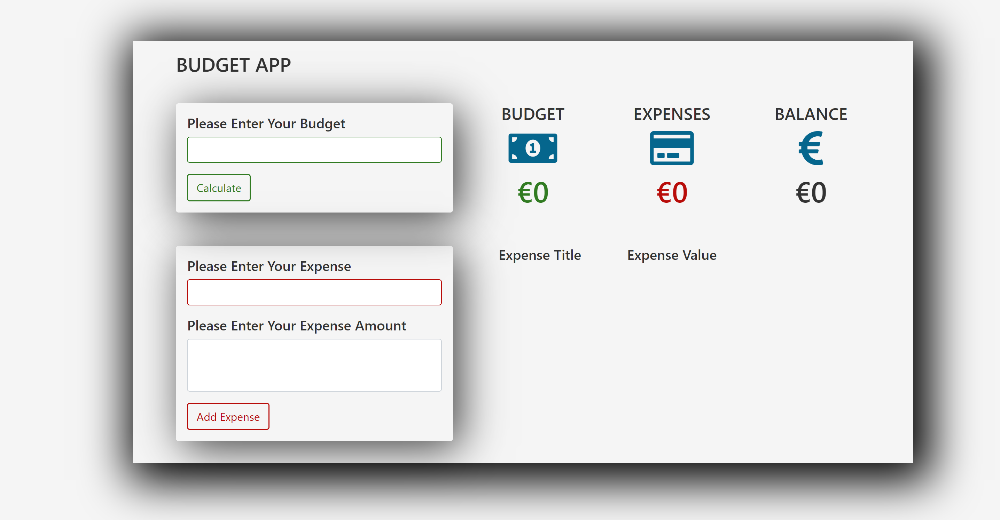

# Budget Me

This app was created using vanilla Javascript, CSS and HTML. The user can add values, add expenses and the input values are rendered accordingly.

# [DEMO](https://budget-me.netlify.com/)
# Preview

# Technologies
*HTML
*CSS
*JavaScript

# Author

Simon Maher